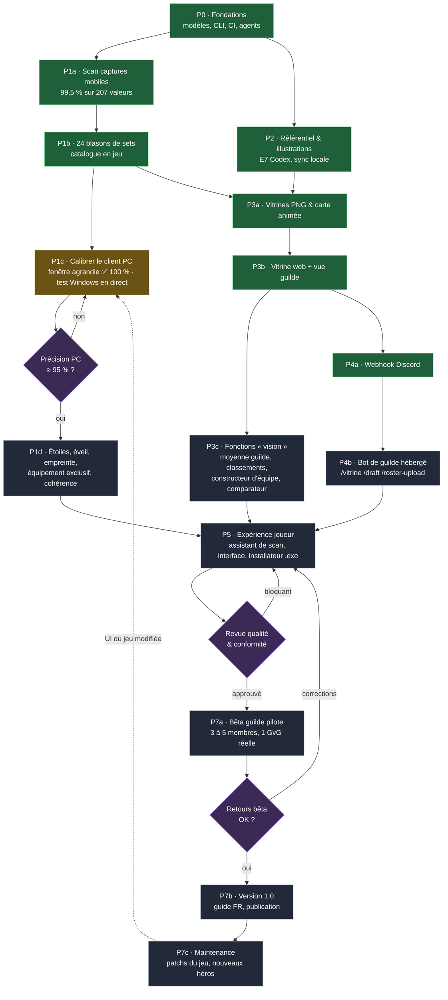
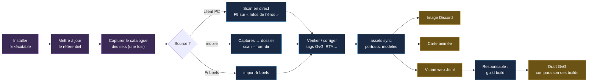
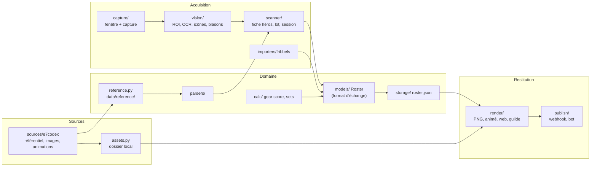
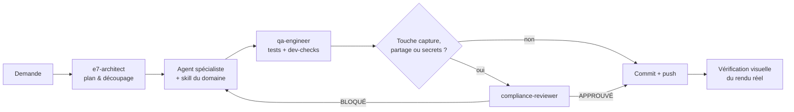

# Plan de projet — E7 Showcase de bout en bout

> Document de pilotage : **où en est le projet, ce qu'il reste à faire, dans quel ordre, par qui,
> et comment savoir qu'une étape est terminée.** Mis à jour le 29/09/2026.
> Le détail des jalons cochés reste dans [ROADMAP.md](ROADMAP.md).

## 1. Objectif final

Un joueur d'Epic Seven installe l'outil, **scanne ses héros** (client PC ou captures mobiles),
et obtient en un clic une **vitrine** complète — image pour Discord, carte animée, et fichier
web autonome — qu'il partage avec sa guilde. Le responsable **fusionne les vitrines** des membres
pour **drafter les équipes** (GvG, RTA, chasses) en comparant les builds.

**Version 1.0** : un exécutable Windows, un guide en français, une précision de scan ≥ 95 % sur
le client PC, et une guilde pilote qui l'utilise pour une vraie guerre de guilde.

## 2. État d'avancement

| Phase | Contenu | État |
|---|---|---|
| **P0** Fondations | Modèles, CLI, CI, agents & skills, conformité | ✅ terminé |
| **P1** Acquisition | Scan « Infos de héros », sets, import Fribbels | ✅ mobile (99,5 %) · PC fenêtre agrandie (100 %) · plein écran 16:9 à vérifier |
| **P2** Référentiel & illustrations | 390 héros, 282 artefacts, portraits, modèles animés | ✅ terminé (mise à jour à automatiser) |
| **P3** Restitution | PNG, carte animée, vitrine web, vue guilde | 🟡 socle ✅ · fonctions « vision » à faire |
| **P4** Partage Discord | Webhook, bot de guilde | 🟡 webhook ✅ · bot à héberger et tester |
| **P5** Expérience joueur | Assistant de scan, interface, installateur Windows | ⬜ à faire |
| **P6** Qualité & conformité | Tests réels PC, CI Windows, relecture finale | 🟡 continu |
| **P7** Lancement | Bêta guilde pilote → v1.0 → maintenance | ⬜ à faire |
| **W1** Plateforme web — socle | Comptes, profils, amis, publications (vitrine/clip/succès), guildes, chat temps réel, forum, RGPD | ✅ socle (API testée + interface React) |
| **W2** Plateforme web — ouverture | Modération & signalements, limitation de débit, vérification d'e-mail, hébergement, import direct du scanner | ⬜ à faire |

## 3. Organigramme des étapes

Les phases s'enchaînent selon leurs dépendances ; les losanges sont des **portes de validation**
qu'il faut franchir avant de continuer.



Légende : 🟩 terminé · 🟨 en cours · ⬛ à faire · 🟪 porte de validation.

**Chemin critique** (ce qui conditionne la date de la v1.0) :
`P1c calibration PC → P1d → P5 installateur → revue qualité → bêta → v1.0`.
Tout le reste (P3c, P4b) avance en parallèle.

## 4. Parcours du joueur (produit fini)



## 5. Architecture (flux de données)



## 6. Structure complète du projet

`✅` existe · `🆕` prévu (phase indiquée).

```text
E7-projects/
├── CLAUDE.md                     ✅ règles du projet pour Claude
├── README.md                     ✅ présentation, installation, commandes
├── pyproject.toml                ✅ dépendances + extras [scan] [render] [bot] [dev]
├── .env.example                  ✅ webhook, token bot, chemins
├── .github/workflows/ci.yml      ✅ ruff, mypy, pytest (Ubuntu + Windows)
├── .claude/
│   ├── agents/                   ✅ 7 agents spécialisés (architecte, vision, données, design,
│   │                                Discord, QA, conformité)
│   ├── skills/                   ✅ 6 skills (domaine E7, calibration, référentiel, rendu,
│   │                                Discord, vérifications)
│   ├── hooks/session-start.sh    ✅ environnement des sessions web
│   └── settings.json             ✅ permissions
├── config/
│   ├── default.toml              ✅ réglages par défaut
│   └── regions/
│       ├── 19_5x9.toml           ✅ mobile — calibré (99,5 %)
│       ├── 16x9.toml             🟡 PC — estimé, à calibrer (P1c)
│       └── 16x10.toml, 21x9.toml 🆕 autres formats d'écran (P1c)
├── data/reference/               ✅ héros, artefacts, sets, libellés FR/EN (généré + manuel)
├── docs/
│   ├── PLAN.md                   ✅ ce document
│   ├── ROADMAP.md                ✅ jalons cochés
│   ├── ARCHITECTURE.md · SCANNING.md · COMPLIANCE.md · AGENTS.md   ✅
│   └── GUIDE_JOUEUR.md           🆕 guide pas à pas illustré (P7b)
├── scripts/
│   ├── update_reference.py       ✅ régénère le référentiel depuis E7 Codex
│   ├── evaluate_captures.py      ✅ mesure la précision du scan
│   ├── derive_profile.py         ✅ estime un profil de zones pour un autre format
│   └── build_exe.py              🆕 construction de l'exécutable Windows (P5)
├── src/e7showcase/
│   ├── models/                   ✅ Hero, Gear, Roster (SCHEMA_VERSION)
│   ├── reference.py              ✅ accès au référentiel, correspondances floues
│   ├── parsers/                  ✅ texte OCR → valeurs, stats, classes
│   ├── calc/                     ✅ gear score, sets actifs
│   │   └── compare.py            🆕 moyennes et rangs de guilde (P3c)
│   ├── capture/                  ✅ fenêtre du jeu, capture d'écran (Windows)
│   ├── vision/                   ✅ zones, OCR, icônes de stats, blasons de sets
│   │   └── stars.py              🆕 étoiles, éveil, rang d'empreinte (P1d)
│   ├── scanner/                  ✅ fiche héros, lot de captures, session en direct
│   │   └── consistency.py        🆕 contrôle base + équipement ≈ stats affichées (P1d)
│   ├── importers/fribbels.py     ✅ import d'un export Fribbels (à valider sur export réel)
│   ├── storage/                  ✅ roster.json local
│   ├── sources/e7codex.py        ✅ référentiel, illustrations, export des animations
│   ├── assets.py                 ✅ images locales du joueur
│   ├── teams/                    🆕 constructeur d'équipe, ordre des tours (P3c)
│   ├── render/                   ✅ PNG, carte animée, vitrine web, vue guilde
│   ├── publish/                  ✅ webhook · 🟡 bot (P4b)
│   ├── gui/                      🆕 assistant de scan et interface (P5)
│   └── cli.py                    ✅ commandes e7showcase
└── tests/                        ✅ 89 tests (+ précision sur captures réelles locales)
    └── e2e/                      🆕 parcours complet sur client PC réel (P6)
```

**Jamais dans le dépôt** : captures, rosters réels, secrets, visuels du jeu (dossier de données
local de chaque joueur uniquement — voir [COMPLIANCE.md](COMPLIANCE.md)).

## 7. Détail des étapes restantes

Chaque étape a un **critère de fin vérifiable**. Colonne « Toi » : ce qui ne peut venir que de toi.

### P1c · Calibrer le client PC (chemin critique)
| | |
|---|---|
| Fait | `config/regions/pc_19x10.toml` calibré (fenêtre agrandie 1920×1080) : **138/138 (100 %)** sur 2 héros ; sets appris depuis la liste des héros ; captures « Impr. écran » brutes acceptées |
| Reste | Scan en direct F9 testé sous Windows ; vérifier `16x9.toml` (plein écran) et 16:10 / 21:9 si besoin ; 3ᵉ héros (fiche de Ludwig) pour la mesure |
| Fin quand | Scan en direct validé sous Windows sur une dizaine de héros |
| Agents · skills | `vision-ocr-engineer` · `calibrate-ocr-regions`, `dev-checks` |
| **Toi** | un test en direct sous Windows (`e7showcase scan`) ; une capture en plein écran si tu joues ainsi |

### P1d · Compléter la lecture du héros
| | |
|---|---|
| Tâches | Étoiles, éveil, rang d'empreinte (SSS…), équipement exclusif ; contrôle de cohérence des stats ; noms EN des 4 sets inconnus ; validation de l'import Fribbels |
| Fin quand | Ces champs lus sur 3 héros réels ; alerte si les stats ne concordent pas |
| Agents · skills | `vision-ocr-engineer`, `e7-game-data-specialist` · `e7-domain`, `e7-reference-data` |
| **Toi** | Nombre de pièces de Réaction / Engagement / Implication ; un export Fribbels réel (facultatif) |

### P3c · Fonctions « vision » de la vitrine (parallèle)
| | |
|---|---|
| Tâches | Barres comparées à la moyenne de guilde, classements par héros, constructeur d'équipe avec ordre des tours, comparateur de 2 héros, thèmes de guilde |
| Fin quand | La maquette 4K est reproduite par `export-html` / `guild build` à partir de vraies données |
| Agents · skills | `e7-architect` (plan), `showcase-designer`, `qa-engineer` · `render-showcase` |
| **Toi** | Valider les priorités ; tester la vue guilde avec 2-3 vrais membres |

### P4b · Bot Discord de guilde (parallèle)
| | |
|---|---|
| Tâches | Tests hors ligne des commandes, `/roster-delete`, `/equipe`, `/qui-a`, droits et limites, hébergement (PC du responsable ou petit serveur) |
| Fin quand | Bot actif sur le serveur de la guilde, 3 membres y ont déposé leur roster |
| Agents · skills | `discord-integrator`, `compliance-reviewer` · `discord-integration` |
| **Toi** | Créer l'application Discord (token) ; choisir l'hébergement ; inviter le bot |

### P5 · Expérience joueur (chemin critique)
| | |
|---|---|
| Tâches | Assistant de scan guidé (étapes à l'écran), interface simple (scanner / vitrine / partager), exécutable Windows autonome (Python, OCR et navigateur inclus), mise à jour du référentiel au lancement |
| Fin quand | Un membre sans connaissance technique installe et produit sa vitrine seul en < 15 min |
| Agents · skills | `e7-architect`, `vision-ocr-engineer`, `showcase-designer`, `qa-engineer` |
| **Toi** | Tester l'installateur sur ton PC ; choisir le nom et l'icône |

### P6 · Qualité & conformité (continu, porte avant la bêta)
| | |
|---|---|
| Tâches | Tests e2e sur client PC réel, CI Windows verte, relecture conformité (CGU, vie privée, droits des visuels), audit sécurité (tags libres, fichiers reçus des membres) |
| Fin quand | `compliance-reviewer` : APPROUVÉ ; CI verte ; aucune donnée réelle dans le dépôt |
| Agents · skills | `qa-engineer`, `compliance-reviewer` · `dev-checks` |

### P7 · Lancement
| | |
|---|---|
| Tâches | Bêta avec 3-5 membres sur une vraie GvG → corrections → v1.0 (guide FR illustré, version publiée) → maintenance après chaque patch du jeu (`update_reference.py`, recalibrage si l'UI change) |
| Fin quand | La guilde pilote utilise la vue guilde pour préparer une GvG complète |
| **Toi** | Recruter les testeurs, recueillir les retours, annoncer la v1.0 |

### W2 · Plateforme web — vers l'ouverture publique
Référence : `docs/platform/ARCHITECTURE.md` (agent `platform-engineer`, skill `platform-dev`).
1. Modération : signalement, file de modération, sanctions ; CGU, mentions légales, âge minimum.
2. Sécurité : limitation de débit, vérification d'e-mail et réinitialisation du mot de passe, CSP.
3. Médias : stockage objet (S3 compatible), transcodage/miniatures des clips.
4. Temps réel multi-instance (Redis pub/sub), notifications en direct.
5. Pont avec le scanner : `e7showcase publish --site` envoie le roster sur le profil ; rendu
   de la vitrine riche (réutiliser `render/webapp`) dans la page profil.
6. Hébergement (PostgreSQL managé, HTTPS), sauvegardes, supervision ; bêta avec la guilde pilote.

## 8. Méthode de travail pour chaque tâche



Définition de « terminé » pour toute modification : `ruff format . && ruff check . && mypy && pytest`
verts, et pour tout rendu, une vérification de l'image ou de la page produite.

## 9. Risques et parades

| Risque | Impact | Parade |
|---|---|---|
| Mise à jour de l'interface du jeu (version Steam) | Scan faussé | Profils de zones versionnés, `evaluate_captures.py` après chaque patch, recalibrage en 1 h |
| Conditions d'utilisation de Smilegate | Blocage du projet | Lecture de pixels uniquement, clics automatiques désactivés par défaut, relecture conformité |
| Disponibilité d'E7 Codex | Plus de nouvelles illustrations | Cache local chez chaque joueur ; le scan et les vitrines fonctionnent sans |
| Taille des fichiers pour Discord (10 Mo) | Partage impossible | Allègement automatique, `--no-anims`, hébergement externe pour les grandes guildes |
| Licence du moteur d'animation Spine | Juridique | Pas de moteur embarqué : export via la visionneuse publique d'E7 Codex |
| Diversité des PC (échelle Windows, formats) | Précision variable | Mode fenêtré 100 % conseillé, profils par format, assistant de scan qui vérifie la fenêtre |
